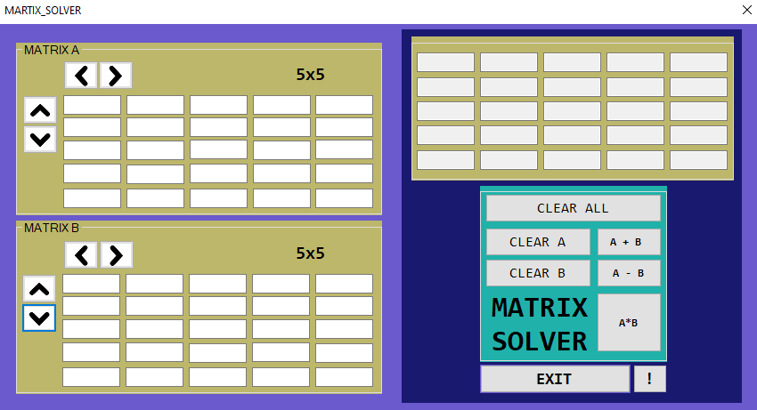

# Matrix Calculator

A matrix calculator with the max dimension of 5x5

## Screenshot

## Issues to note
- Purely If-Else statements 
- Might be full of bugs
- Created by my noob self at that time

## Things to work on
- Proper use of functions
- String manipulation
- Loops
- Improve design
  
Good luck reading the source code! 

